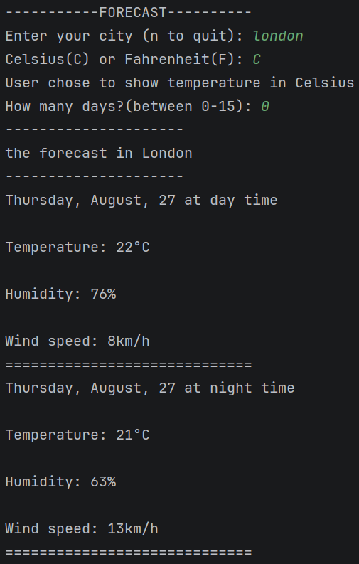

# Python Weather Forecast

A command-line weather forecast application built with Python and the Open-Meteo API.

The program allows the user to enter a city, choose between Celsius and Fahrenheit, and select a forecast period of up to 15 days.

# Features

* Search for a city
* Display temperatures in Celsius or Fahrenheit
* Get forecasts for up to 15 days
* Display average humidity
* Display average wind speed
* Separate daytime and nighttime forecasts
* Handle invalid city names
* Validate the number of forecast days
* Uses the Open-Meteo API
* No API key required

# Technologies

* Python
* Requests
* Open-Meteo API
* REST API
* JSON

# Preview



#Installation

# 1. Clone the repository

```bash
git clone https://github.com/basma-elbarri/weather-forecast-api.git
```

# 2. Enter the project folder

```bash
cd weather-forecast-api
```

# 3. Install the required package

```bash
pip install -r requirements.txt
```

# 4. Run the program

```bash
weather_forecast.py
```

# How to Use

When the program starts, enter the name of a city.

```text
Enter your city (n to quit): Paris
```

Then choose the temperature unit:

```text
Celsius(C) or Fahrenheit(F): C
```

Finally, choose how many days you want to forecast:

```text
How many days?(between 0-15): 5
```

The program will then retrieve the weather data and display information such as:

* Temperature
* Humidity
* Wind speed
* Day/night forecast

To exit the program, enter:

```text
n
```

# API

This project uses the Open-Meteo APIs:

* Geocoding API — converts the city name into latitude and longitude.
* Forecast API — retrieves the weather forecast using those coordinates.

No API key is required.

# What I Learned

This project helped me practice:

* Making API requests with Python
* Working with REST APIs
* Processing JSON data
* Extracting information from nested dictionaries
* Handling invalid API responses
* Validating user input
* Working with dates and `datetime`
* Using loops and conditional statements
* Converting temperatures between Celsius and Fahrenheit
* Working with Git and GitHub

# Future Improvements

* [ ] Add better handling for network errors
* [ ] Allow the user to choose specific forecast dates
* [ ] Improve the day/night calculation
* [ ] Add weather descriptions and icons
* [ ] Add a graphical user interface
* [ ] Improve the command-line interface
* [ ] Add more detailed forecast information
* [ ] Add automated tests


**BASM4.A**

GitHub: https://github.com/basma-elbarri

---

⭐ If you like the project, consider giving it a star!
